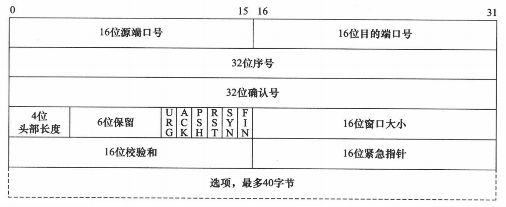
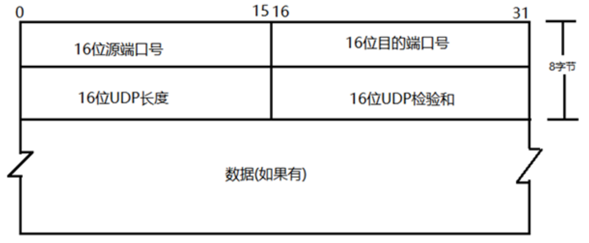
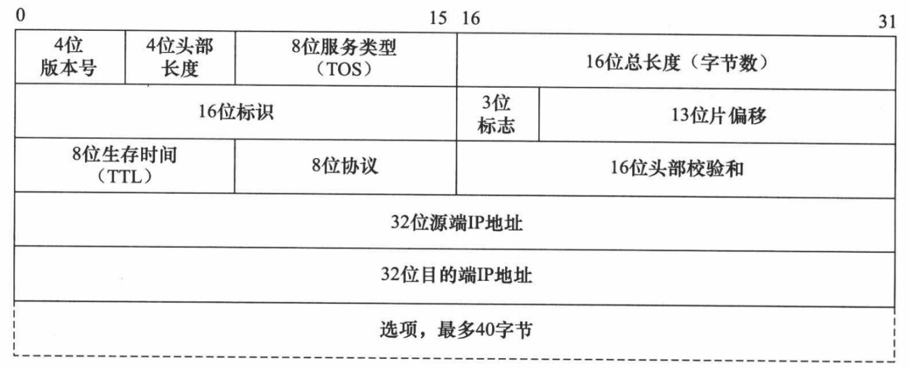
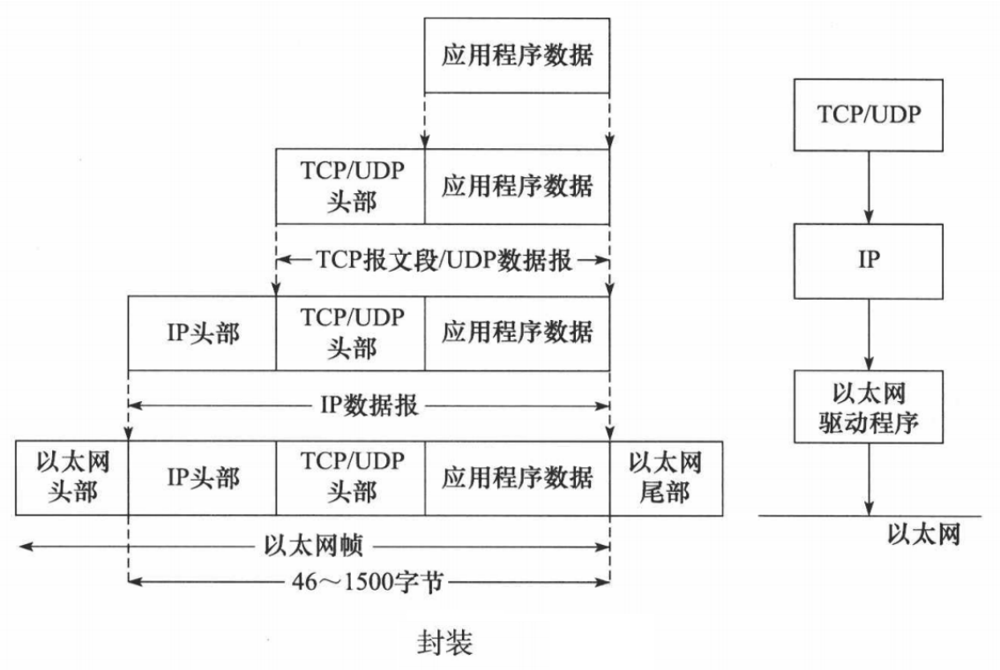
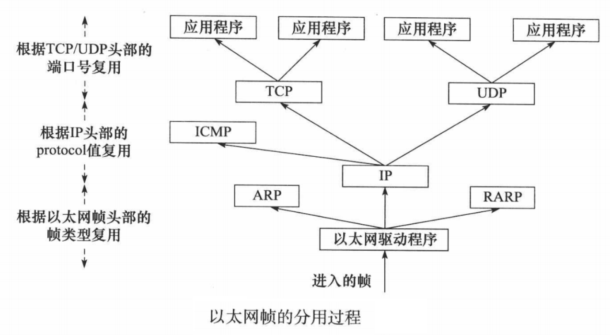
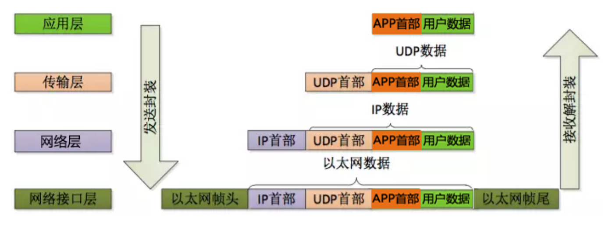

# table of contents

- [网络结构](#网络结构)
  - [CS结构](#cs结构)
    - [CS简介](#cs简介)
    - [CS优点](#cs优点)
    - [CS缺点](#cs缺点)
  - [BS结构](#bs结构)
    - [BS简介](#bs简介)
    - [BS优点](#bs优点)
    - [BS缺点](#bs缺点)
- [网络模型](#网络模型)
  - [OSI模型](#osi模型)
  - [TCP/IP模型](#tcpip模型)
- [网络地址](#网络地址)
  - [MAC地址](#mac地址)
  - [IP地址](#ip地址)
  - [端口](#端口)
    - [周知端口](#周知端口)
    - [注册端口](#注册端口)
    - [动态/私有端口](#动态私有端口)
- [网络协议](#网络协议)
  - [HTTP协议](#http协议)
  - [TCP协议](#tcp协议)
  - [UDP协议](#udp协议)
  - [IP协议](#ip协议)
- [网络设备](#网络设备)
- [网络通信过程](#网络通信过程)
  - [封装](#封装)
  - [分用](#分用)
  - [通信过程](#通信过程)

## [网络结构](#table-of-contents)

### [CS结构](#table-of-contents)

#### [CS简介](#table-of-contents)

```text
服务器 - 客户机，即 Client - Server（C/S）结构。C/S 结构通常采取两层结构。服务器负责数据的管理，客户机负责完成与用户的交互任务。客户机是因特网上访问别人信息的机器，服务器则是提供信息供人访问的计算机。

客户机通过局域网与服务器相连，接受用户的请求，并通过网络向服务器提出请求，对数据库进行操作。服务器接受客户机的请求，将数据提交给客户机，客户机将数据进行计算并将结果呈现给用户。服务器还要提供完善安全保护及对数据完整性的处理等操作，并允许多个客户机同时访问服务器，这就对服务器的硬件处理数据能力提出了很高的要求。

在C/S结构中，应用程序分为两部分：服务器部分和客户机部分。服务器部分是多个用户共享的信息与功能，执行后台服务，如控制共享数据库的操作等；客户机部分为用户所专有，负责执行前台功能，在出错提示、在线帮助等方面都有强大的功能，并且可以在子程序间自由切换。
```

#### [CS优点](#table-of-contents)

1. 能充分发挥客户端 PC 的处理能力，很多工作可以在客户端处理后再提交给服务器，所以 C/S 结构客户端响应速度快；
2. 操作界面漂亮、形式多样，可以充分满足客户自身的个性化要求；
3. C/S 结构的管理信息系统具有较强的事务处理能力，能实现复杂的业务流程；
4. 安全性较高，C/S 一般面向相对固定的用户群，程序更加注重流程，它可以对权限进行多层次校验，提供了更安全的存取模式，对信息安全的控制能力很强，一般高度机密的信息系统采用 C/S 结构适宜。

#### [CS缺点](#table-of-contents)

1. 客户端需要安装专用的客户端软件。首先涉及到安装的工作量，其次任何一台电脑出问题，如病毒、硬件损坏，都需要进行安装或维护。系统软件升级时，每一台客户机需要重新安装，其维护和升级成本非常高；
2. 对客户端的操作系统一般也会有限制，不能够跨平台。
3. 服务器端的硬件要求较高，需要有较大的存储空间和较高的处理能力，而且服务器端的软件也需要有较高的安全性，以防止客户端的非法访问。

### [BS结构](#table-of-contents)

#### [BS简介](#table-of-contents)

```text
浏览器 - 服务器，即 Browser - Server（B/S）结构。B/S 结构是一种新型的 C/S 结构，它将原来的客户机的应用程序部分移到服务器端，使得客户机上只需要安装浏览器，而服务器端安装应用程序，客户机通过浏览器向服务器端发送请求，服务器端接收到请求后进行处理，并将结果返回给客户机，客户机再将结果显示出来。

B/S 结构的应用程序是在服务器端运行的，客户机只需要安装浏览器，不需要安装应用程序，因此，B/S 结构的应用程序的安装和维护都比较方便，只需要在服务器端进行安装和维护即可，而且，B/S 结构的应用程序可以跨平台，只要客户机上安装了浏览器，就可以访问服务器端的应用程序，不需要考虑客户机的操作系统。

B/S 结构的应用程序的安装和维护都比较方便，只需要在服务器端进行安装和维护即可，而且，B/S 结构的应用程序可以跨平台，只要客户机上安装了浏览器，就可以访问服务器端的应用程序，不需要考虑客户机的操作系统。
```

#### [BS优点](#table-of-contents)

1. B/S 架构最大的优点是总体拥有成本低、维护方便、 分布性强、开发简单，可以不用安装任何专门的软件就能实现在任何地方进行操作，客户端零维护，系统的扩展非常容易，只要有一台能上网的电脑就能使用。

#### [BS缺点](#table-of-contents)

1. 通信开销大、系统和数据的安全性较难保障;
2. 个性特点明显降低，无法实现具有个性化的功能要求；
3. 协议一般是固定的：http/https
4. 客户端服务器端的交互是请求-响应模式，通常动态刷新页面，响应速度明显降低。

## [网络模型](#table-of-contents)

> 

### [OSI模型](#table-of-contents)

> OSI(Open System Interconnection)开放式系统互联，是国际标准化组织（ISO）提出的一个概念性的框架，目的是为了使不同厂商生产的计算机能够互联互通。一般分为七层，从下到上分别是：物理层、数据链路层、网络层、传输层、会话层、表示层、应用层。

```text
物理层：主要定义物理设备标准，如网线的接口类型、光纤的接口类型、各种传输介质的传输速率等。它的主要作用是传输比特流（就是由1、0转化为电流强弱来进行传输，到达目的地后再转化为1、0，也就是我们常说的数模转换与模数转换）。这一层的数据叫做比特。

数据链路层：建立逻辑连接、进行硬件地址寻址、差错校验等功能。定义了如何让格式化数据以帧为单位进行传输，以及如何让控制对物理介质的访问。将比特组合成字节进而组合成帧，用MAC地址访问介质。

网络层：进行逻辑地址寻址，在位于不同地理位置的网络中的两个主机系统之间提供连接和路径选择。Internet的发展使得从世界各站点访问信息的用户数大大增加，而网络层正是管理这种连接的层。

传输层：定义了一些传输数据的协议和端口号（ WWW 端口 80 等），如：TCP（传输控制协议，传输效率低，可靠性强，用于传输可靠性要求高，数据量大的数据），UDP（用户数据报协议，与TCP特性恰恰相反，用于传输可靠性要求不高，数据量小的数据，如QQ聊天数据就是通过这种方式传输的）。 主要是将从下层接收的数据进行分段和传输，到达目的地址后再进行重组。常常把这一层数据叫做段。

会话层：通过传输层（端口号：传输端口与接收端口）建立数据传输的通路。主要在你的系统之间发起会话或者接受会话请求。

表示层：数据的表示、安全、压缩。主要是进行对接收的数据进行解释、加密与解密、压缩与解压缩等（也就是把计算机能够识别的东西转换成人能够能识别的东西（如图片、声音等）。

应用层：网络服务与最终用户的一个接口。这一层为用户的应用程序（例如电子邮件、文件传输和终端仿真）提供网络服务。
```

### [TCP/IP模型](#table-of-contents)

> 现在 Internet（因特网）使用的主流协议族是 TCP/IP 协议族，它是一个分层、多协议的通信体系。TCP/IP协议族是一个四层协议系统，自底而上分别是数据链路层、网络层、传输层和应用层。每一层完成不同的功能，且通过若干协议来实现，上层协议使用下层协议提供的服务。
>
> 

```text
应用层：应用层是 TCP/IP 协议的第一层，是直接为应用进程提供服务的。
    对不同种类的应用程序它们会根据自己的需要来使用应用层的不同协议，邮件传输应用使用了 SMTP 协议、万维网应用使用了 HTTP 协议、远程登录服务应用使用了有 TELNET 协议。
    应用层还能加密、解密、格式化数据。
    应用层可以建立或解除与其他节点的联系，这样可以充分节省网络资源。

传输层：作为 TCP/IP 协议的第二层，运输层在整个 TCP/IP 协议中起到了中流砥柱的作用。且在运输层中， TCP 和 UDP 也同样起到了中流砥柱的作用。

网络层：网络层在 TCP/IP 协议中的位于第三层。在 TCP/IP 协议中网络层可以进行网络连接的建立和终止以及 IP 地址的寻找等功能。

网络接口层：在 TCP/IP 协议中，网络接口层位于第四层。由于网络接口层兼并了物理层和数据链路层所以，网络接口层既是传输数据的物理媒介，也可以为网络层提供一条准确无误的线路。
```

## [网络地址](#table-of-contents)

### [MAC地址](#table-of-contents)

```text
MAC 地址（Media Access Control Address），直译为媒体存取控制位址，也称为局域网地址、以太网地址、物理地址或硬件地址，它是一个用来确认网络设备位置的位址，由网络设备制造商生产时烧录在网卡中。

在 OSI 模型中，MAC 地址是数据链路层的地址，用于在同一网络中唯一标识网络设备。若一台设备拥有多个网络接口（网卡），则每个接口都需要一个 MAC 地址。

MAC 地址共 48 位，前 24 位为厂商编号，由 IEEE（电气与电子工程师协会）分配，后 24 位为该厂商的网卡流水号，通常用 12 个 16 进制数表示。例如：00-0C-29-3E-2C-8C。
```

### [IP地址](#table-of-contents)

```text
IP 地址（Internet Protocol Address）是指互联网协议地址，又译为网际协议地址。IP 地址是 IP 协议提供的一种统一的地址格式，它为互联网上的每一个网络和每一台主机分配一个逻辑地址，以此来屏蔽物理地址的差异。

IP 地址是一个 32 位的二进制数，通常被分割为 4 个“ 8 位二进制数”（也就是 4 个字节）。IP 地址通常用“点分十进制”表示成（a.b.c.d）的形式，其中，a,b,c,d都是 0~255 之间的十进制整数。例：点分十进IP地址（100.4.5.6），实际上是 32 位二进制数（01100100.00000100.00000101.00000110）
```

> internet委员会将IP地址分为A、B、C、D、E五类，其中A、B、C三类为常用地址，D类为多播地址，E类为保留地址。

| 类别 | 最大网络数 | 单个网段最大主机数 | IP 地址范围 | 私有 IP 地址范围 | 子网掩码 |
| :--- | :--- | :--- | :--- | :--- | :--- |
| A类 | 126(2^7-2) | 16777214(2^24-2) | 1.0.0.1 ~ 126.255.255.254 | 10.0.0.0 ~ 10.255.255.255 | 255.0.0.0 |
| B类 | 16384(2^14) | 65534(2^16-2) | 128.0.0.1 ~ 191.255.255.254 | 172.16.0.0 ~ 172.31.255.255 | 255.255.0.0 |
| C类 | 2097152(2^21) | 254(2^8-2) | 192.0.0.1 ~ 223.255.255.254 | 192.168.0.0 ~ 192.168.255.255 | 255.255.255.0 |

> 一个 A 类 IP 地址是指， 在 IP 地址的四段号码中，第一段号码为网络号码。如果用二进制表示 IP 地址的话，A 类 IP 地址就由 1 字节的网络地址和 3 字节主机地址组成，网络地址的最高位必须是“0”。最后一个是广播地址。
>
> 一个 B 类 IP 地址是指，在 IP 地址的四段号码中，前两段号码为网络号码。如果用二进制表示 IP 地址的话，B 类 IP 地址就由 2 字节的网络地址和 2 字节主机地址组成，网络地址的最高位必须是“10”。最后一个是广播地址。
>
> 一个 C 类 IP 地址是指，在 IP 地址的四段号码中，前三段号码为网络号码。如果用二进制表示 IP 地址的话，B 类 IP 地址就由 3 字节的网络地址和 1 字节主机地址组成，网络地址的最高位必须是“110”。最后一个是广播地址。
>
> D 类 IP 地址在历史上被叫做多播地址（multicast address），即组播地址。在以太网中，多播地址命名了一组应该在这个网络中应用接收到一个分组的站点。多播地址的最高位必须是“1110”，范围从224.0.0.0 ~ 239.255.255.255。
>
> E类IP地址以“llll0”开始，为将来使用保留。范围从 240.0.0.0 ~ 255.255.255.254，其中 255.255.255.255 用于广播地址。

```text
每一个字节都为 0 的地址（ “0.0.0.0” ）对应于当前主机；

IP 地址中的每一个字节都为 1 的 IP 地址（ “255.255.255.255” ）是当前子网的广播地址；

IP 地址中凡是以 “11110” 开头的 E 类 IP 地址都保留用于将来和实验使用。

IP地址中不能以十进制 “127” 作为开头，该类地址中数字 127.0.0.1 到 127.255.255.255 用于回路测试，如：127.0.0.1可以代表本机IP地址。
```

> 子网掩码

```text
子网掩码（subnet mask）又叫网络掩码、地址掩码、子网络遮罩，它是一种用来指明一个 IP 地址的哪些位标识的是主机所在的子网，以及哪些位标识的是主机的位掩码。子网掩码不能单独存在，它必须结合 IP 地址一起使用。子网掩码只有一个作用，就是将某个 IP 地址划分成网络地址和主机地址两部分。

子网掩码是一个 32 位地址，用于屏蔽 IP 地址的一部分以区别网络标识和主机标识，并说明该 IP地址是在局域网上，还是在广域网上。
```

> 子网掩码的作用

```text
子网掩码是在 IPv4 地址资源紧缺的背景下为了解决 lP 地址分配而产生的虚拟 lP 技术，通过子网掩码将 A、B、C 三类地址划分为若干子网，从而显著提高了 IP 地址的分配效率，有效解决了 IP 地址资源紧张的局面。另一方面，在企业内网中为了更好地管理网络，网管人员也利用子网掩码的作用，人为地将一个较大的企业内部网络划分为更多个小规模的子网，再利用三层交换机的路由功能实现子网互联，从而有效解决了网络广播风暴和网络病毒等诸多网络管理方面的问题。

在大多数的网络教科书中，一般都将子网掩码的作用描述为通过逻辑运算，将 IP 地址划分为网络标识(Net.ID) 和主机标识(Host.ID)，只有网络标识相同的两台主机在无路由的情况下才能相互通信。

根据 RFC950 定义，子网掩码是一个 32 位的 2 进制数， 其对应网络地址的所有位都置为 1，对应于主机地址的所有位置都为 0。子网掩码告知路由器，地址的哪一部分是网络地址，哪一部分是主机地址，使路由器正确判断任意 IP 地址是否是本网段的，从而正确地进行路由。网络上，数据从一个地方传到另外一个地方，是依靠 IP 寻址。从逻辑上来讲，是两步的。第一步，从 IP 中找到所属的网络，好比是去找这个人是哪个小区的；第二步，再从 IP 中找到主机在这个网络中的位置，好比是在小区里面找到这个人。

子网掩码的设定必须遵循一定的规则。与二进制 IP 地址相同，子网掩码由 1 和 0 组成，且 1 和 0 分别连续。子网掩码的长度也是 32 位，左边是网络位，用二进制数字 “1” 表示，1 的数目等于网络位的长度；右边是主机位，用二进制数字 “0” 表示，0 的数目等于主机位的长度。这样做的目的是为了让掩码与 IP 地址做按位与运算时用 0 遮住原主机数，而不改变原网络段数字，而且很容易通过 0 的位数确定子网的主机数（ 2 的主机位数次方 - 2，因为主机号全为 1 时表示该网络广播地址，全为 0 时表示该网络的网络号，这是两个特殊地址）。通过子网掩码，才能表明一台主机所在的子网与其他子网的关系，使网络正常工作
```

### [端口](#table-of-contents)

```text
“端口” 是英文 port 的意译，可以认为是设备与外界通讯交流的出口。端口可分为虚拟端口和物理端口，其中虚拟端口指计算机内部或交换机路由器内的端口，不可见，是特指TCP/IP协议中的端口，是逻辑意义上的端口。例如计算机中的 80 端口、21 端口、23 端口等。物理端口又称为接口，是可见端口，计算机背板的 RJ45 网口，交换机路由器集线器等 RJ45 端口。电话使用 RJ11 插口也属于物理端口的范畴。

如果把 IP 地址比作一间房子，端口就是出入这间房子的门。真正的房子只有几个门，但是一个 IP 地址的端口可以有 65536（即：2^16）个之多！端口是通过端口号来标记的，端口号只有整数，范围是从 0 到65535（2^16-1）。
```

#### [周知端口](#table-of-contents)

```text
周知端口（Well Known Ports）是众所周知的端口号，也叫知名端口、公认端口或者常用端口，范围从 0 到 1023，它们紧密绑定于一些特定的服务。例如 80 端口分配给 WWW 服务，21 端口分配给 FTP 服务，23 端口分配给Telnet服务等等。我们在 IE 的地址栏里输入一个网址的时候是不必指定端口号的，因为在默认情况下 WWW 服务的端口是 “80”。网络服务是可以使用其他端口号的，如果不是默认的端口号则应该在地址栏上指定端口号，方法是在地址后面加上冒号“:”（半角），再加上端口号。比如使用 “8080” 作为 WWW 服务的端口，则需要在地址栏里输入“网址:8080”。但是有些系统协议使用固定的端口号，它是不能被改变的，比如 139 端口专门用于 NetBIOS 与 TCP/IP 之间的通信，不能手动改变。
```

#### [注册端口](#table-of-contents)

```text
注册端口（Registered Ports）端口号从 1024 到 49151，它们松散地绑定于一些服务，分配给用户进程或应用程序，这些进程主要是用户选择安装的一些应用程序，而不是已经分配好了公认端口的常用程序。这些端口在没有被服务器资源占用的时候，可以用用户端动态选用为源端口。
```

#### [动态/私有端口](#table-of-contents)

```text
动态/私有端口（Dynamic Ports / Private Ports）的范围是从 49152 到 65535。之所以称为动态端口，是因为它一般不固定分配某种服务，而是动态分配。
```

## [网络协议](#table-of-contents)

> 网络协议是计算机网络通信中必须遵守的规则或规范，网络协议是为了实现网络中的数据通信而建立的规则、标准或约定。它使互联网中的计算机能够相互通信，是互联网得以发展的基础。
>
> 网络协议三要素：语法、语义、时序。

### [常见协议](#table-of-contents)

```text
应用层：FTP协议（File Transfer Protocol 文件传输协议）、HTTP协议（Hyper Text Transfer Protocol 超文本传输协议）、NFS（Network File System 网络文件系统）。

传输层：TCP协议（Transmission Control Protocol 传输控制协议）、UDP协议（User Datagram Protocol 用户数据报协议）。

网络层：IP协议（Internet Protocol 网际协议）、ICMP协议（Internet Control Message Protocol 网际控制报文协议）、IGMP协议（Internet Group Management Protocol 网际组管理协议）。

网络接口层：ARP协议（Address Resolution Protocol 地址解析协议）、RARP协议（Reverse Address Resolution Protocol 反向地址解析协议）。
```

### [HTTP协议](#table-of-contents)

```text
超文本传输协议（Hypertext Transfer Protocol，HTTP）是一个简单的请求 - 响应协议，它通常运行在 TCP 之上。它指定了客户端可能发送给服务器什么样的消息以及得到什么样的响应。请求和响应消息的头以 ASCII 形式给出；而消息内容则具有一个类似 MIME 的格式。HTTP是万维网的数据通信的基础。

HTTP的发展是由蒂姆·伯纳斯-李于1989年在欧洲核子研究组织（CERN）所发起。HTTP的标准制定由万维网协会（World Wide Web Consortium，W3C）和互联网工程任务组（Internet Engineering Task Force，IETF）进行协调，最终发布了一系列的RFC，其中最著名的是1999年6月公布的 RFC 2616，定义了HTTP协议中现今广泛使用的一个版本——HTTP 1.1。

HTTP 是一个客户端终端（用户）和服务器端（网站）请求和应答的标准（TCP）。通过使用网页浏览器、网络爬虫或者其它的工具，客户端发起一个HTTP请求到服务器上指定端口（默认端口为80）。我们称这个客户端为用户代理程序（user agent）。应答的服务器上存储着一些资源，比如 HTML 文件和图像。我们称这个应答服务器为源服务器（origin server）。在用户代理和源服务器中间可能存在多个“中间层”，比如代理服务器、网关或者隧道（tunnel）。

尽管 TCP/IP 协议是互联网上最流行的应用，HTTP 协议中，并没有规定必须使用它或它支持的层。事实上，HTTP可以在任何互联网协议上，或其他网络上实现。HTTP 假定其下层协议提供可靠的传输。因此，任何能够提供这种保证的协议都可以被其使用。因此也就是其在 TCP/IP 协议族使用 TCP 作为其传输层。

通常，由HTTP客户端发起一个请求，创建一个到服务器指定端口（默认是80端口）的 TCP 连接。HTTP服务器则在那个端口监听客户端的请求。一旦收到请求，服务器会向客户端返回一个状态，比如"HTTP/1.1 200 OK"，以及返回的内容，如请求的文件、错误消息、或者其它信息。
```

### [TCP协议](#table-of-contents)

```text
传输控制协议（TCP，Transmission Control Protocol）是一种面向连接的、可靠的、基于字节流的传输层通信协议。它能够保证数据不丢包、不乱序，因此被广泛应用于互联网通信中。

TCP协议的主要特点是面向连接，这意味着在应用程序使用TCP协议之前，必须先建立TCP连接。在传输数据完毕后，必须释放已经建立的TCP连接。每一条TCP连接只能有两个端点，每一条TCP连接只能是点对点的（一对一）。

TCP协议还提供了可靠传输的服务。通过TCP连接传输的数据，无差错、不丢失、不重复，并且按序到达。此外，TCP还提供了全双工通信，允许通信双方的应用进程在任何时候都能发送数据。TCP连接的两端都设有发送缓存和接收缓存，用来临时存放双向通信的数据。
```

> TCP 确保可靠性的方式：

```text
重传机制：当 TCP 发送端发出一个报文段后，它启动一个定时器，等待目的端确认收到这个报文段。如果不能及时收到一个确认，将重传这个报文段。
  超时重传：当 TCP 发送端收到一个对报文段的确认，它将从定时器中删除这个报文段的定时器。如果发送端定时器超时，将重传这个报文段。
  快速重传：当 TCP 发送端收到一个对报文段的确认，它将检查确认中的确认号，如果确认号小于发送端已发送的最大的顺序号，将重传缺失的报文段。在 TCP 头部结构中的选项字段中有一个 SACK 选项，它允许 TCP 发送端只重传丢失的报文段，而不是重传所有的报文段。

滑动窗口：TCP 采用滑动窗口协议来实现流量控制。TCP 连接的每一方都有一个固定大小的缓冲区，TCP 的接收端只允许另一端发送接收端缓冲区所能接纳的数据，这就是所谓的流量控制。

流量控制：TCP 连接的每一方都有一个固定大小的缓冲区，TCP 的接收端只允许另一端发送接收端缓冲区所能接纳的数据，这就是所谓的流量控制。

拥塞控制：当网络拥塞时，减少数据的发送。
```

> 

1. 源端口号：发送方端口号
2. 目的端口号：接收方端口号
3. 序列号：本报文段的数据的第一个字节的序号
4. 确认序号：期望收到对方下一个报文段的第一个数据字节的序号
5. 首部长度（数据偏移）：TCP 报文段的数据起始处距离 TCP 报文段的起始处有多远，即首部长度。单位：32位，即以 4 字节为计算单位
6. 保留：占 6 位，保留为今后使用，目前应置为 0
7. 紧急 URG ：此位置 1 ，表明紧急指针字段有效，它告诉系统此报文段中有紧急数据，应尽快传送
8. 确认 ACK：仅当 ACK=1 时确认号字段才有效，TCP 规定，在连接建立后所有传达的报文段都必须把 ACK 置1
9. 推送 PSH：当两个应用进程进行交互式的通信时，有时在一端的应用进程希望在键入一个命令后立即就能够收到对方的响应。在这种情况下，TCP 就可以使用推送（push）操作，这时，发送方 TCP 把 PSH 置 1，并立即创建一个报文段发送出去，接收方收到 PSH = 1 的报文段，就尽快地（即“推送”向前）交付给接收应用进程，而不再等到整个缓存都填满后再向上交付
10. 复位 RST：用于复位相应的 TCP 连接
11. 同步 SYN：仅在三次握手建立 TCP 连接时有效。当 SYN = 1 而 ACK = 0 时，表明这是一个连接请求报文段，对方若同意建立连接，则应在相应的报文段中使用 SYN = 1 和 ACK = 1。因此，SYN 置 1 就表示这是一个连接请求或连接接受报文
12. 终止 FIN：用来释放一个连接。当 FIN = 1 时，表明此报文段的发送方的数据已经发送完毕，并要求释放运输连接
13. 窗口：指发送本报文段的一方的接收窗口（而不是自己的发送窗口）
14. 校验和：校验和字段检验的范围包括首部和数据两部分，在计算校验和时需要加上 12 字节的伪头部
15. 紧急指针：仅在 URG = 1 时才有意义，它指出本报文段中的紧急数据的字节数（紧急数据结束后就是普通数据），即指出了紧急数据的末尾在报文中的位置，注意：即使窗口为零时也可发送紧急数据
16. 选项：长度可变，最长可达 40 字节，当没有使用选项时，TCP 首部长度是 20 字节

### [UDP协议](#table-of-contents)

```text
用户数据报协议（UDP，User Datagram Protocol）是一个简单的面向数据报的运输层协议。UDP 协议不提供可靠性、流量控制、拥塞控制、差错控制等功能，但是 UDP 协议的头部开销小，传输数据报的效率高。

UDP 协议是无连接的，即发送数据之前不需要建立连接，因此 UDP 协议的开销小，传输数据报的效率高。但是，UDP 协议不提供可靠性，因此应用程序必须有自己的差错控制和流量控制机制，这使得应用程序的开发变得复杂。

UDP 协议是面向报文的，发送方的 UDP 对应用程序交下来的报文，在添加首部后就向下交付 IP 层。UDP 对应用程序交下来的报文，既不合并，也不拆分，而是保留这些报文的边界，因此，应用程序需要选择合适的报文大小。

UDP 协议没有拥塞控制，一旦某个应用程序发送速率太高，使得网络出现拥塞，那么 UDP 协议也不会对此进行任何控制，因此，网络拥塞的程度会越来越严重。

UDP 协议支持一对一、一对多、多对一和多对多的交互通信。
```

> 

1. 源端口号：发送方端口号
2. 目的端口号：接收方端口号
3. 长度：UDP用户数据报的长度，最小值是8（仅有首部）
4. 校验和：检测UDP用户数据报在传输中是否有错，有错就丢弃

### [IP协议](#table-of-contents)

```text
IP 协议是 TCP/IP 协议族的核心协议，它负责把上层交下来的数据包传送给对方。IP 协议位于网络层，处于 TCP 协议的下层，上层是 ICMP 协议、IGMP 协议和 IPX 协议等。

IP 协议的作用是把分组从源结点运输到目的结点，它定义了分组的格式和传输规则。IP 协议的两个主要功能是：为分组交换网提供数据报服务和寻址功能。

IP 协议的主要特点是：无连接、不可靠、无差错、无需确认、无需流量控制、无序到达。
```

> 

1. 版本：IP 协议的版本。通信双方使用过的 IP 协议的版本必须一致，目前最广泛使用的 IP 协议版本号为 4（即IPv4），而 IPv6 的版本号为 6
2. 首部长度：单位是 32 位（4 字节）
3. 服务类型：一般不适用，取值为 0
4. 总长度：指首部加上数据的总长度，单位为字节
5. 标识（identification）：IP 软件在存储器中维持一个计数器，每产生一个数据报，计数器就加 1，并将此值赋给标识字段
6. 标志（flag）：目前只有两位有意义。标志字段中的最低位记为 MF。MF = 1 即表示后面“还有分片”的数据报。MF = 0 表示这已是若干数据报片中的最后一个。标志字段中间的一位记为 DF，意思是“不能分片”，只有当 DF = 0 时才允许分片
7. 片偏移：指出较长的分组在分片后，某片在源分组中的相对位置，也就是说，相对于用户数据段的起点，该片从何处开始。片偏移以 8 字节为偏移单位。
8. 生存时间：TTL，表明是数据报在网络中的寿命，即为“跳数限制”，由发出数据报的源点设置这个字段。路由器在转发数据之前就把 TTL 值减一，当 TTL 值减为零时，就丢弃这个数据报。
9. 协议：指出此数据报携带的数据时使用何种协议，以便使目的主机的 IP 层知道应将数据部分上交给哪个处理过程，常用的 ICMP(1)，IGMP(2)，TCP(6)，UDP(17)，IPv6（41）
10. 首部校验和：只校验数据报的首部，不包括数据部分。
11. 源地址：发送方 IP 地址
12. 目的地址：接收方 IP 地址

### [ICMP协议](#table-of-contents)

```text
```

### [ARP协议](#table-of-contents)

```text
```

## [网络设备](#table-of-contents)

## [网络通信过程](#table-of-contents)

### [封装](#table-of-contents)

```text
上层协议通过下层协议的服务来传输数据，上层协议把数据传递给下层协议，下层协议再把数据传递给下一层协议，直到传递到物理层，物理层再把数据传递给物理介质，这个过程称为封装（Encapsulation）。

封装的过程是从上到下的，每经过一层协议，都会在数据前面加上一个首部，这个首部包含了该层协议的一些信息，这些信息是该层协议传递数据所必须的，这样，数据就被一层一层地封装起来，直到传递到物理层，物理层再把数据传递给物理介质。
```

> 

### [分用](#table-of-contents)

```text
分用（Demultiplexing）是指接收方从收到的数据中识别出上层协议的过程。在接收方，数据是从下层协议开始向上层协议传递的，接收方从下层协议的首部中识别出上层协议的类型，然后把数据传递给相应的上层协议，这个过程称为分用。
```

> 

### [通信过程](#table-of-contents)

> 
