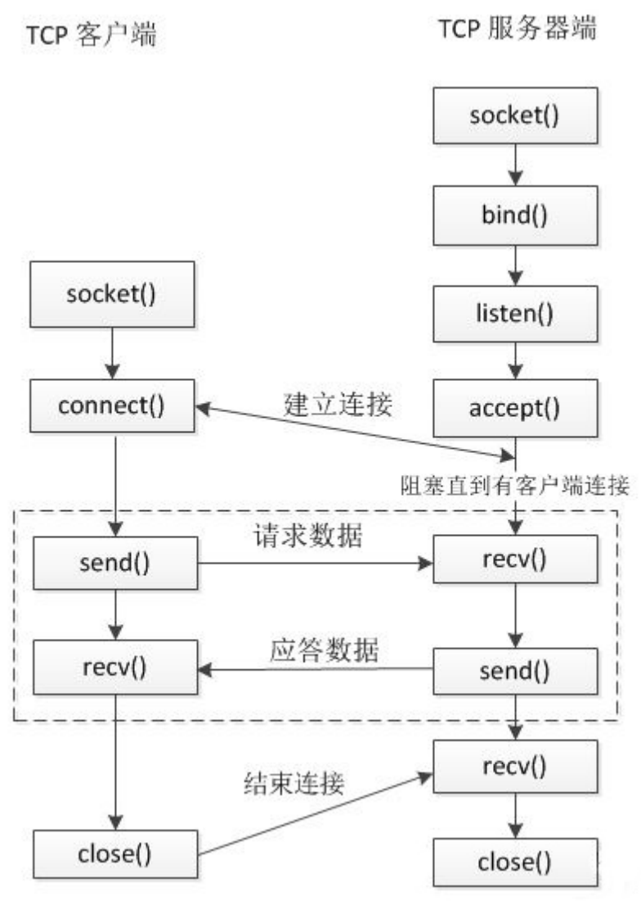
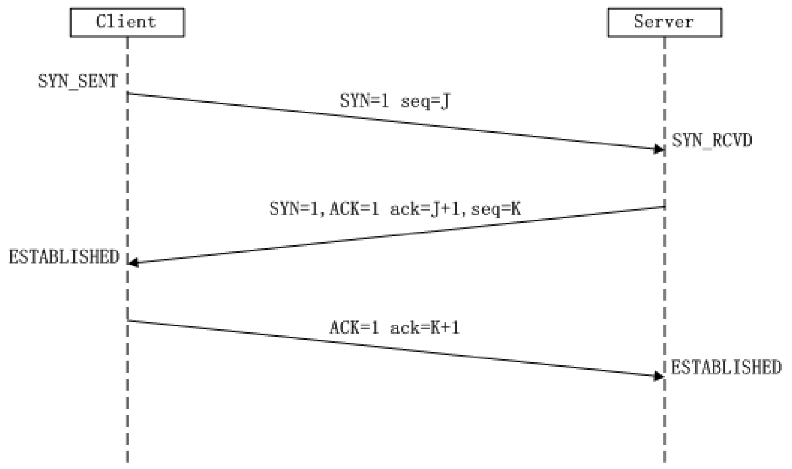
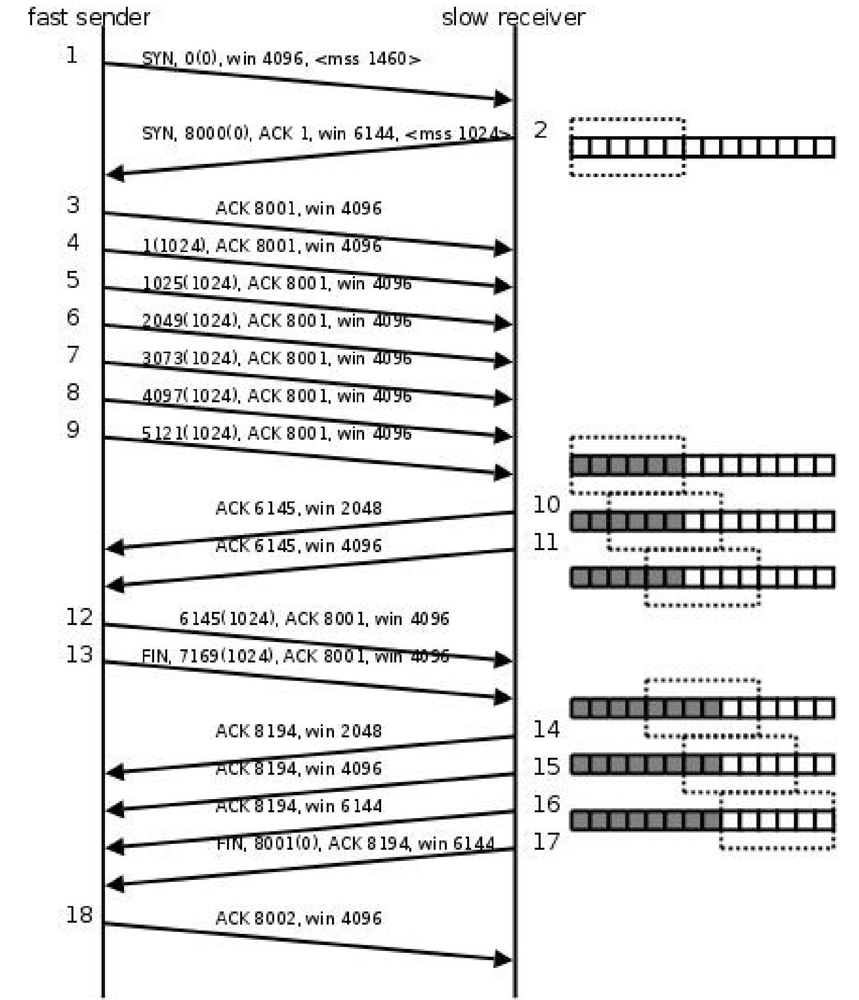
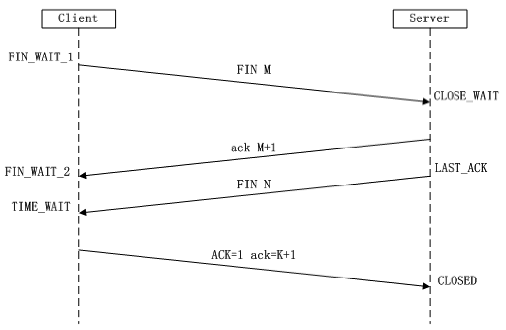
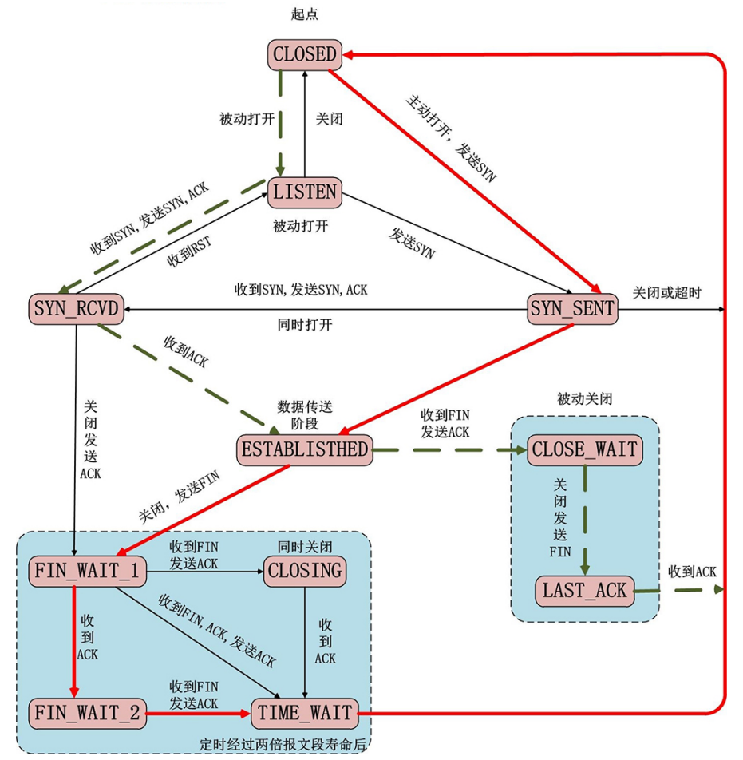

# table of contents

- [TCP通信流程](#tcp通信流程)
  - [通信函数](#通信函数)
  - [三次握手](#三次握手)
  - [滑动窗口](#滑动窗口)
  - [四次挥手](#四次挥手)
- [TCP状态转换](#tcp状态转换)
- [端口复用](#端口复用)

## [TCP通信流程](#table-of-contents)

> 

```text
1. 服务器端调用 socket() 函数创建套接字，然后调用 bind() 函数将套接字与特定的IP地址和端口号绑定，接着调用 listen() 函数将套接字转换为监听（被动）套接字，这样就完成了服务器端的初始化工作。

2. 客户端调用 socket() 函数创建套接字，然后调用 connect() 函数向服务器端发起连接请求，这样就完成了客户端的初始化工作。

3. 服务器端调用 accept() 函数从已完成连接队列中取出一个客户端连接请求，然后调用 fork() 函数创建一个子进程，子进程调用 close() 函数关闭监听套接字，然后调用 read() 和 write() 函数与客户端进行通信，父进程则继续调用 accept() 函数等待其他客户端的连接请求。

4. 客户端调用 read() 和 write() 函数与服务器端进行通信，通信完成后调用 close() 函数关闭套接字，然后终止进程。
```

### [通信函数](#table-of-contents)

> TCP通信函数如下：

```c
#include <sys/types.h>
#include <sys/socket.h>
#include <arpa/inet.h> // 包含了这个头文件，上面两个头文件可省略

int socket(int domain, int type, int protocol);
    功能：创建一个套接字
    
    参数：
        domain：协议域，即地址类型
            AF_INET：IPv4协议
            AF_INET6：IPv6协议
            AF_LOCAL：Unix域协议
        type：套接字类型
            SOCK_STREAM：流式套接字，即TCP协议
            SOCK_DGRAM：数据报套接字，即UDP协议
        protocol：协议类型，通常为0，表示使用默认协议
    
    返回值：
        成功：返回套接字描述符
        失败：返回-1，errno被设置为相应的错误码

int bind(int sockfd, const struct sockaddr *addr, socklen_t addrlen);
    功能：将套接字与特定的IP地址和端口号绑定
    
    参数：
        sockfd：套接字描述符
        addr：指向要绑定给套接字的IP地址和端口号
        addrlen：addr的长度，通常为sizeof(struct sockaddr_in)
    
    返回值：
        成功：返回0
        失败：返回-1，errno被设置为相应的错误码

int listen(int sockfd, int backlog);
    功能：将套接字转换为监听（被动）套接字
    
    参数：
        sockfd：套接字描述符
        backlog：已完成连接队列的最大长度
    
    返回值：
        成功：返回0
        失败：返回-1，errno被设置为相应的错误码

int accept(int sockfd, struct sockaddr *addr, socklen_t *addrlen);
    功能：从已完成连接队列中取出一个客户端连接请求
    
    参数：
        sockfd：套接字描述符
        addr：指向用于存放客户端IP地址和端口号的结构体
        addrlen：addr的长度，通常为sizeof(struct sockaddr_in)
    
    返回值：
        成功：返回已连接套接字描述符
        失败：返回-1，errno被设置为相应的错误码

int connect(int sockfd, const struct sockaddr *addr, socklen_t addrlen);
    功能：向服务器端发起连接请求
    
    参数：
        sockfd：套接字描述符
        addr：指向要连接的服务器端IP地址和端口号
        addrlen：addr的长度，通常为sizeof(struct sockaddr_in)
    
    返回值：
        成功：返回0
        失败：返回-1，errno被设置为相应的错误码
```

### [三次握手](#table-of-contents)

```text
TCP协议是面向连接的协议，即在通信之前必须先建立连接，而建立连接的过程就是三次握手。

TCP可以看作是一种字节流，它会处理IP层或以下层的数据报的重复、丢失、失序等问题，在连接的建立过程中，双方需要交换一些连接的参数。这些参数可以放在 TCP 头部。

三次握手发生在客户端调用 connect() 函数之后，服务器端调用 accept() 函数之前。
```

> 

```text
第一次握手：
1.客户端将 SYN 标志位置为 1
2.生成一个随机的32位的序号 seq=J ，这个序号后边是可以携带数据（数据的大小）

第二次握手：
1.服务器端接收客户端的连接：ACK=1
2.服务器会回发一个确认序号：ack=客户端的序号 + 数据长度 + SYN/FIN(按一个字节算)
3.服务器端会向客户端发起连接请求：SYN=1
4.服务器会生成一个随机序号：seq=K

第三次握手：
1.客户单应答服务器的连接请求：ACK=1
2.客户端回复收到了服务器端的数据：ack=服务端的序号 + 数据长度 + SYN/FIN(按一个字节算)
```

### [滑动窗口](#table-of-contents)

```text
滑动窗口（Sliding Window）是 TCP 协议中的一个重要概念，它是 TCP 协议实现流量控制的一种机制。

早期网络通信中，通信双方不会考虑网络拥挤状态，发送方会一直发送数据，接收方会一直接收数据，这样会导致网络拥堵，丢包率高，传输效率低下。滑动窗口机制就是为了解决这个问题而产生的。

滑动窗口容许发送方在接受任何应答之前发送多个数据包，而不需要等待接收方的应答。滑动窗口的大小取决于接收方的缓冲区大小，发送方的滑动窗口大小不能超过接收方的缓冲区大小。

窗口可以理解为缓冲区，其大小会随着数据的变化而变化，通信双方都各自有发送窗口和接收窗口，发送窗口的大小取决于接收窗口的大小，接收窗口的大小取决于接收方的缓冲区大小。
```

> 

```text
# mss: Maximum Segment Size(一条数据的最大的数据量)
# win: 滑动窗口
1. 客户端向服务器发起连接，客户单的滑动窗口是4096，一次发送的最大数据量是1460
2. 服务器接收连接情况，告诉客户端服务器的窗口大小是6144，一次发送的最大数据量是1024
3. 第三次握手
4. 4-9 客户端连续给服务器发送了6k的数据，每次发送1k
5. 第10次，服务器告诉客户端：发送的6k数据以及接收到，存储在缓冲区中，缓冲区数据已经处理了2k,窗 口大小是2k
6. 第11次，服务器告诉客户端：发送的6k数据以及接收到，存储在缓冲区中，缓冲区数据已经处理了4k,窗 口大小是4k
7. 第12次，客户端给服务器发送了1k的数据
8. 第13次，客户端主动请求和服务器断开连接，并且给服务器发送了1k的数据
9. 第14次，服务器回复ACK 8194,
    a:同意断开连接的请求
    b:告诉客户端已经接受到方才发的2k的数据
    c:滑动窗口2k
10.第15、16次，通知客户端滑动窗口的大小
11.第17次，第三次挥手，服务器端给客户端发送FIN,请求断开连接
12.第18次，第四次回收，客户端同意了服务器端的断开请求
```

### [四次挥手](#table-of-contents)

```text
TCP协议是面向连接的协议，即在通信之后必须断开连接，而断开连接的过程就是四次挥手。

四次挥手发生在断开连接的时候，在程序中当调用了close()会使用TCP协议进行四次挥手。

客户端和服务器端都可以主动发起断开连接，谁先调用close()谁就是发起。

因为在TCP连接的时候，采用三次握手建立的的连接是双向的，在断开的时候需要双向断开。
```

> 

```text
第一次挥手：
1.客户端向服务器发送断开连接的请求：FIN=1
2.客户端会生成一个随机序号：seq=J

第二次挥手：
1.服务器接收到客户端的断开连接请求：ACK=1
2.服务器会回复客户端一个确认序号：ack=客户端的序号 + 1
3.服务器会生成一个随机序号：seq=K

第三次挥手：
1.服务器向客户端发送断开连接的请求：FIN=1
2.服务器会生成一个随机序号：seq=L

第四次挥手：
1.客户端接收到服务器的断开连接请求：ACK=1
2.客户端会回复服务器一个确认序号：ack=服务器的序号 + 1
```

## [TCP状态转换](#table-of-contents)

> 

```text
2MSL：Maximum Segment Lifetime）
主动断开的一方进入 TIME_WAIT 状态，等待 2MSL 后才进入 CLOSED 状态，这是为了保证最后一个 ACK 报文能够到达对方，从而让对方进入 CLOSED 状态。

半关闭
当 TCP 链接中 A 向 B 发送 FIN 请求关闭，另一端 B 回应 ACK 之后（A 端进入 FIN_WAIT_2 状态），并没有立即发送 FIN 给 A，A 方处于半连接状态（半开关），此时 A 可以接收 B 发送的数据，但是 A 已经不能再向 B 发送数据。
```

> 使用 API 实现半连接

```c
#include <sys/types.h>
#include <sys/socket.h>
#include <arpa/inet.h> // 包含了这个头文件，上面两个头文件可省略

int shutdown(int sockfd, int how);
    功能：关闭套接字的一部分功能
    
    参数：
        sockfd：套接字描述符
        how：关闭方式
            SHUT_RD：关闭读功能
            SHUT_WR：关闭写功能
            SHUT_RDWR：关闭读写功能
    
    返回值：
        成功：返回0
        失败：返回-1，errno被设置为相应的错误码
```

```text
使用 close 中止一个连接，但它只是减少描述符的引用计数，并不直接关闭连接，只有当描述符的引用计数为 0 时才关闭连接。shutdown 不考虑描述符的引用计数，直接关闭描述符。也可选择中止一个方向的连接，只中止读或只中止写。

如果有多个进程共享一个套接字，close 每被调用一次，计数减 1 ，直到计数为 0 时，也就是所用进程都调用了 close，套接字将被释放。

在多进程中如果一个进程调用了 shutdown(sfd, SHUT_RDWR) 后，其它的进程将无法进行通信。但如果一个进程 close(sfd) 将不会影响到其它进程。
```

## [端口复用](#table-of-contents)

```text
在 TCP 通信中，如果服务器端主动断开连接，那么服务器端的端口将处于 TIME_WAIT 状态，此时如果再次启动服务器程序，将无法绑定到该端口，因为该端口处于 TIME_WAIT 状态，此时如果想要再次启动服务器程序，就需要等待 2MSL 时间，这样就会导致服务器程序不能立即启动。

为了解决这个问题，可以使用端口复用，即在服务器程序中设置 SO_REUSEADDR 选项，这样就可以立即启动服务器程序。

SO_REUSEADDR 选项的作用是允许在同一端口上启动同一服务器的多个实例，但每个实例绑定的 IP 地址不同。这通常用于同时侦听多个接口（对于 TCP 服务器应用程序，侦听多个接口可以实现负载均衡）。
```

> 使用 API 实现端口复用

```c
#include <sys/types.h>
#include <sys/socket.h>
#include <arpa/inet.h> // 包含了这个头文件，上面两个头文件可省略

int setsockopt(int sockfd, int level, int optname, const void *optval, socklen_t optlen);
    功能：设置套接字选项
    
    参数：
        sockfd：套接字描述符
        level：选项所在的协议层
            SOL_SOCKET：通用套接字选项
            IPPROTO_TCP：TCP协议选项
            IPPROTO_IP：IP协议选项
        optname：选项名称
            SO_REUSEADDR：允许在同一端口上启动同一服务器的多个实例
            SO_REUSEPORT：允许完全重复的绑定
        optval：指向存放选项值的缓冲区
            1：开启
            0：关闭
        optlen：optval的长度，通常为sizeof(int)
    
    返回值：
        成功：返回0
        失败：返回-1，errno被设置为相应的错误码
```

```text
端口复用，设置的时机是在服务器绑定端口之前。
setsockopt();
bind();
```
