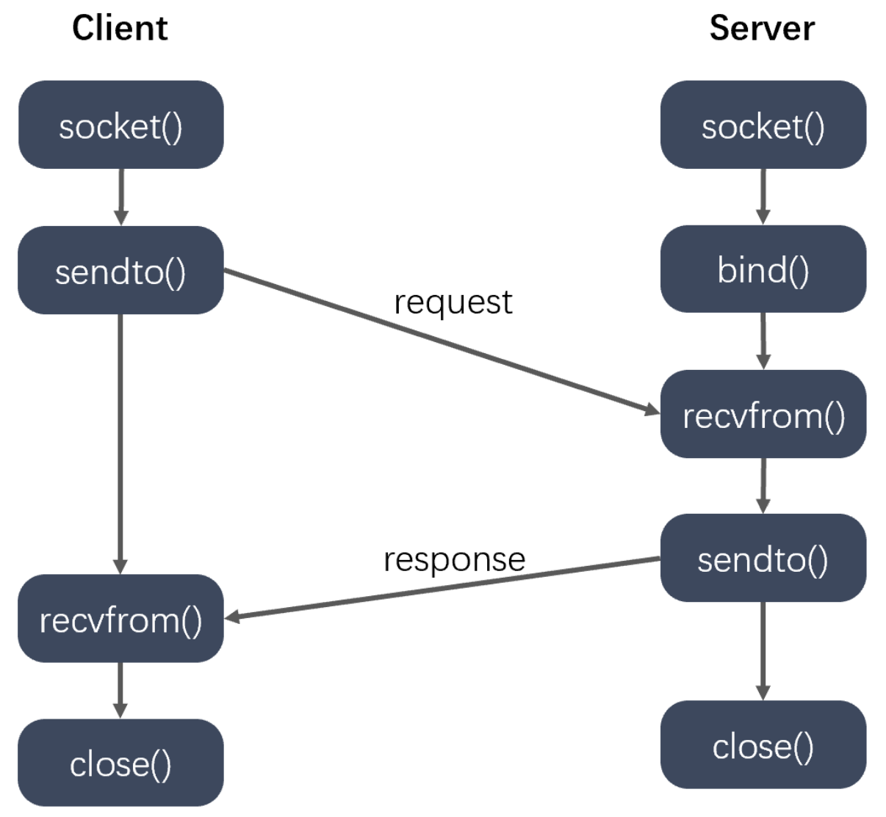

# table of contents

- [UDP通信](#udp通信)
  - [UDP通信特点](#udp通信特点)
  - [UDP通信流程](#udp通信流程)
- [单播](#单播)
  - [单播通信](#单播通信)
- [广播](#广播)
  - [广播通信](#广播通信)
- [组播](#组播)
  - [组播通信](#组播通信)
  
## UDP通信

### UDP通信特点

- 将数据及源和目的封装成数据包中，不需要建立连接
- 每个数据报的大小限制在64K内
- 因无连接，是不可靠协议
- 不需要建立连接，速度快

### UDP通信流程

> 

- 发送端
  - 建立发送端的Socket对象
  - 创建数据，并打包
  - 调用Socket对象的发送方法发送数据包
  - 关闭Socket对象

- 接收端
  - 建立接收端的Socket对象
  - 创建一个数据包，用于接收数据
  - 调用Socket对象的接收方法接收数据包
  - 解析数据包，并显示在控制台

## 单播

### 单播通信

## 广播

### 广播通信

## 组播

### 组播通信
