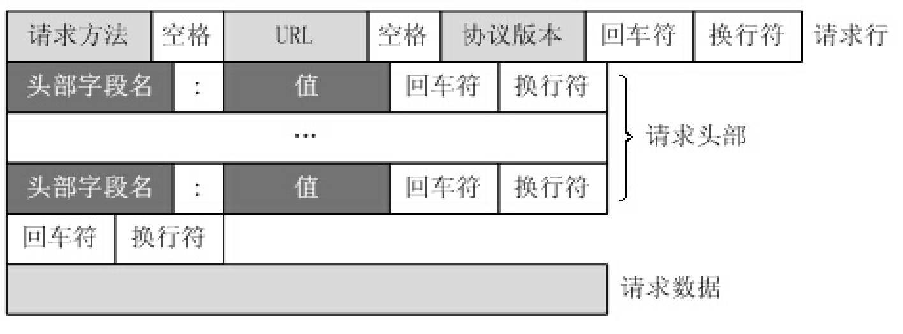
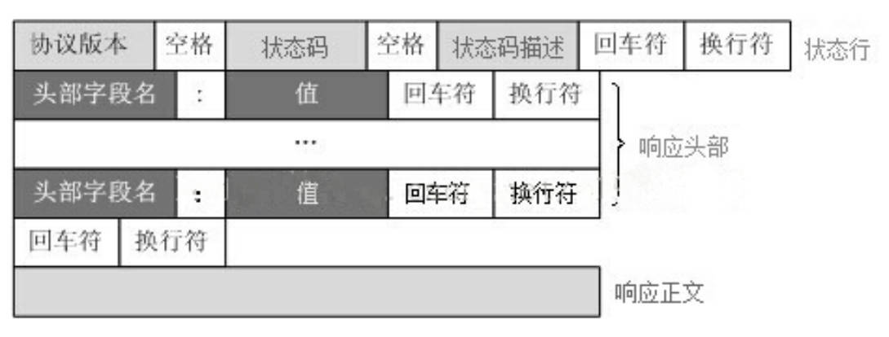

# table of contents

## [HTTP](#table-of-contents)

```text
HTTP（HyperText Transfer Protocol，超文本传输协议）是一种用于分布式、协作式和超媒体信息系统的应用层协议。

HTTP 是万维网的数据通信基础，它通常运行在 TCP 之上，指定客户端可能发送的请求消息和服务器可能返回的响应消息的格式。
请求和响应消息的头以 ASCII 码形式给出；而消息内容则具有一个类似 MIME 的格式。
```

## [工作原理](#table-of-contents)

```text
HTTP 协议定义 Web 客户端如何从 Web 服务器请求 Web 页面，以及服务器如何把 Web 页面传送给客户端。

HTTP 协议采用了请求/响应模型。客户端向服务器发送一个请求报文，请求报文包含请求的方法、URL、协议版本、请求头部和请求数据。服务器以一个状态行作为响应，响应的内容包括协议的版本、成功或者错误代码、服务器信息、响应头部和响应数据。

HTTP 默认端口号为 80，但是你也可以改为别的端口。
```

```text
HTTP 请求/响应流程：
1. 客户端连接到 Web 服务器
    浏览器向 DNS 请求解析 URL 中的域名，获取域名对应的 IP 地址；根据 IP 地址和端口号建立 TCP 连接。

2. 发送 HTTP 请求
    浏览器向服务器发送 HTTP 请求报文，请求报文包括请求行、请求头部、空行和请求数据。该请求报文作为 TCP 三次握手的第三个报文的数据发送给服务器。

3. 服务器接受请求并返回 HTTP 响应
    服务器解析请求报文，如果请求报文格式正确，服务器将返回一个 HTTP 响应报文，响应报文包括状态行、响应头部、空行和响应数据。

4. 释放连接 TCP 连接
    若 connection 模式为 close，则服务器主动关闭 TCP 连接，客户端被动关闭连接；若 connection 模式为 keepalive，则该连接会保持一段时间，在该时间内可以继续接收请求。

5. 客户端浏览器解析 HTML 内容
    浏览器解析 HTML 内容，如果 HTML 中引用了其他资源，如图片、CSS、JS 等，浏览器将重复上述过程，直到把所有的资源都下载下来，页面显示完成。
```

## [HTTP 请求报文](#table-of-contents)

```text
HTTP 请求报文由请求行、请求头部、空行和请求数据 4 个部分组成，如下图所示：
```

> 

```text
GET /index.html HTTP/1.1
Host: www.baidu.com
Connection: keep-alive
Cache-Control: max-age=0
Upgrade-Insecure-Requests: 1
User-Agent: Mozilla/5.0 (Windows NT 6.1; WOW64)
Accept: text/html,application/xhtml+xml,application/xml;q=0.9,image/webp,*/*;q=0.8
Accept-Encoding: gzip, deflate, sdch
Accept-Language: zh-CN,zh;q=0.8

name=hello&age=18
```

```text
请求行：
    请求方法：GET、POST、PUT、DELETE、HEAD、OPTIONS、TRACE、CONNECT
    请求 URL：http://www.baidu.com/index.html
    协议版本：HTTP/1.1

请求头部：
    Host：请求的主机名，允许多个域名同处一个 IP 地址，即虚拟主机
    Connection：连接类型，keep-alive 或 close
    Cache-Control：缓存控制
    Upgrade-Insecure-Requests：升级为 HTTPS 请求
    User-Agent：用户代理，即浏览器信息
    Accept：客户端可识别的内容类型列表
    Accept-Encoding：客户端可识别的内容编码列表
    Accept-Language：客户端可识别的语言列表

空行：
    请求头部结束的标志，空行后面的数据作为请求数据处理

请求数据：
    GET 请求没有请求数据，POST 请求有请求数据，请求数据格式为 key=value&key=value
```

## [HTTP 响应报文](#table-of-contents)

```text
HTTP 响应报文由状态行、响应头部、空行和响应数据 4 个部分组成，如下图所示：
```

> 

```text
HTTP/1.1 200 OK
Date: Tue, 31 Oct 2017 08:00:00 GMT
Content-Type: text/html; charset=utf-8
Content-Length: 138
Last-Modified: Tue, 31 Oct 2017 08:00:00 GMT
Connection: keep-alive
ETag: "59f8f0c0-8a"
Accept-Ranges: bytes
```
