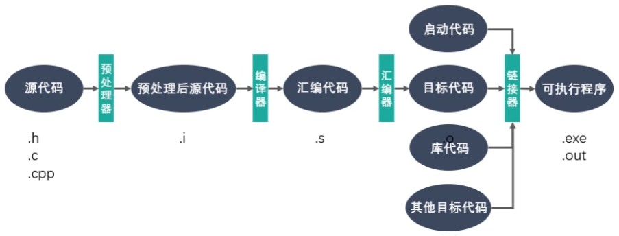

# table of contents
- [安装](#安装)
- [工作流程](#工作流程)
  - [预处理](#预处理)
  - [编译](#编译)
  - [汇编](#汇编)
  - [链接](#链接)
- [参数](#参数)

## [安装](#table-of-contents)
```bash
sudo apt-get install gcc
```

## [工作流程](#table-of-contents)
> 

### [预处理](#table-of-contents)
> 预处理器将源代码中的宏定义、头文件包含、条件编译等预处理指令进行处理，生成一个没有宏定义、没有注释、没有头文件包含、所有条件编译都已经决定的中间文件。
```bash
gcc -E hello.c -o hello.i
```

### [编译](#table-of-contents)
> 编译器将预处理后的文件进行词法分析、语法分析、语义分析、优化和代码生成，生成汇编代码。
```bash
gcc -S hello.i -o hello.s
```

### [汇编](#table-of-contents)
> 汇编器将汇编代码转换成机器可以执行的指令，生成目标文件。
```bash
gcc -c hello.s -o hello.o
```

### [链接](#table-of-contents)
> 链接器将目标文件和库文件进行链接，生成可执行文件。
```bash
gcc hello.o -o hello
```

## [参数](#table-of-contents)
| 参数 | 说明 | 示例 | 结果 |
| --- | --- | --- | --- |
| -o | 指定输出文件名 | gcc -o hello hello.c | 生成可执行文件hello |
| -E | 只运行预处理器 | gcc -E hello.c | 输出预处理后的文件 |
| -S | 只编译不汇编 | gcc -S hello.c | 生成汇编代码hello.s |
| -c | 只编译不链接 | gcc -c hello.c | 生成目标文件hello.o |
| --- | --- | --- | --- |
| -v | 显示编译器的版本信息 | gcc -v | 显示版本信息 |
| -o0 | 优化级别0 | gcc -o0 hello.c | 没有优化 |
| -o1 | 优化级别1 | gcc -o1 hello.c | 缺省级别 |
| -o2 | 优化级别2 | gcc -o2 hello.c | 优化 |
| -o3 | 优化级别3 | gcc -o3 hello.c | 更多优化 |
| -w | 不显示警告信息 | gcc -w hello.c | 不显示警告信息 |
| -Wall | 显示所有警告信息 | gcc -Wall hello.c | 显示所有警告信息 |
| -g | 生成调试信息 | gcc -g hello.c | 生成调试信息 |
| -D | 定义宏 | gcc -D DEBUG hello.c | 定义宏DEBUG |
| --- | --- | --- | --- |
| -I | 指定头文件的搜索路径 | gcc -I /usr/include hello.c | 指定头文件的搜索路径 |
| -L | 指定库文件的搜索路径 | gcc -L /usr/lib hello.c | 指定库文件的搜索路径 |
| -l | 指定链接的库文件 | gcc -l m hello.c | 指定链接的库文件 |
| -fpic | 生成位置无关的代码 | gcc -fpic hello.c | 生成位置无关的代码 |
| -shared | 生成共享库 | gcc -shared hello.c -o libhello.so | 生成共享库libhello.so |
| -static | 静态链接 | gcc -static hello.c | 静态链接 |
| -std | 指定C语言的版本 | gcc -std=c99 hello.c | 指定C语言的版本为C99 |
