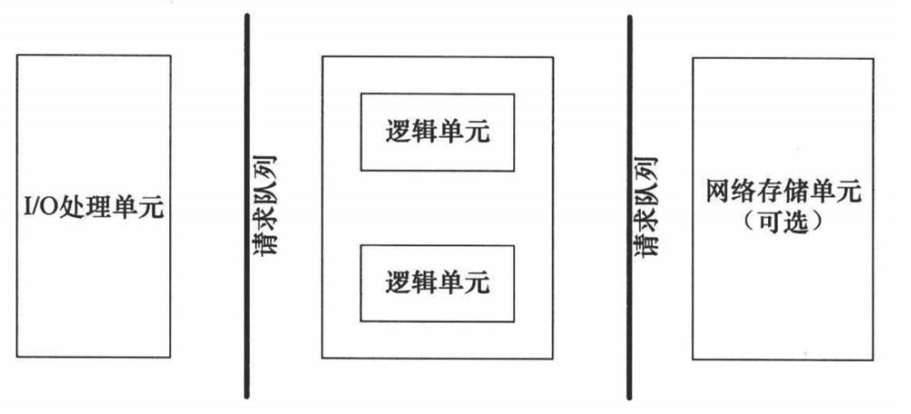

# table of contents

- [服务器框架](#服务器框架)
- [框架的作用](#框架的作用)
  - [处理HTTP](#处理http)
  - [路由](#路由)
  - [获取请求数据](#获取请求数据)
  - [数据库交互](#数据库交互)
  - [模板](#模板)
- [实现逻辑](#实现逻辑)
- [事件处理](#事件处理)
  - [reactor模式](#reactor模式)
  - [proactor模式](#proactor模式)

## [服务器框架](#table-of-contents)

```text
服务器端框架 (亦称 "web 应用框架") 使编写、维护和扩展 web 应用更加容易。它们提供工具和库来实现简单、常见的开发任务，包括 路由处理，数据库交互，会话支持和用户验证，格式化输出 (e.g. HTML, JSON, XML), 提高安全性应对网络攻击。
```

```text
服务器框架有很多种，它们之间的异同点也很多。一般来说，不同的服务器框架会有不同的语言、架构、性能、文档完善度、案例丰富度、热更新支持等方面的差异。

例如，Java的Spring框架和Python的Django框架都是大而全的框架，提供了丰富的功能和工具，但它们使用的语言不同。Python的Flask框架和Golang的Gin框架都是小而精的框架，提供了快速灵活的开发体验，但它们使用的语言也不同。

此外，不同的服务器框架还会有不同的性能表现、文档完善度、案例丰富度等方面的差异。例如，有些框架可能在处理高并发请求时表现更优秀，而有些框架则在文档完善度和案例丰富度方面更胜一筹。

总之，不同的服务器框架各有所长，选择哪种框架取决于您的具体需求和喜好。
```

## [框架的作用](#table-of-contents)

```text
框架的作用是提供一套标准的解决方案，让开发者不用重复造轮子，专注于业务逻辑的实现。框架的目的是提高开发效率，降低开发成本，提高代码质量，提高系统的可维护性。
```

### [处理HTTP](#table-of-contents)

```text
web 服务器和浏览器通过 HTTP 协议进行通信——服务器等待来自浏览器的 HTTP 请求然后在 HTTP 回应中返回相关信息。

web 框架允许你编写简单语法的代码，即可生成处理这些请求和回应的代码。这意味着你的工作变得简单、交互变得简单、并且使用抽象程度高的代码而不是底层代码。
```

### [路由](#table-of-contents)

```text
大多数的站点会提供一系列不同资源，通过特定的 URL 来访问。如果都放在一个函数里面，网站会变得很难维护。所以 web 框架提供一个简单机制来匹配 URL 和特定处理函数。这种方式对网站维护也有好处，因为你只需要改变用来传输特定功能的 URL 而不用改变任何底层代码。

不同的框架使用不同机制进行匹配。比如 Flask（Python）框架通过使用装饰器来增加视图的路由， Rails（Ruby）框架使用一个单独的文件来定义路由，而 Django（Python）框架使用一个单独的 URLconf 文件来定义路由。
```

### [获取请求数据](#table-of-contents)

```text
web 应用通常需要从请求中获取数据。这些数据可能是用户提交的表单数据，或者是 URL 中的查询字符串。web 框架提供了一种简单的方式来获取这些数据，而不用你自己去解析它们。
```

### [数据库交互](#table-of-contents)

```text
大多数的 web 应用都需要和数据库进行交互。web 框架提供了一种简单的方式来连接数据库，执行查询和获取结果。这种方式使得你可以专注于你的应用而不是数据库的细节。
```

### [模板](#table-of-contents)

```text
web 应用通常需要生成 HTML 页面。web 框架提供了一种简单的方式来生成 HTML 页面，而不用你自己去编写 HTML 代码。这种方式使得你可以专注于你的应用而不是 HTML 的细节。
```

## [实现逻辑](#table-of-contents)

> 

```text
服务器框架的实现逻辑有很多特点。一般来说，服务器框架都包括I/O处理单元、逻辑单元、网络存储单元和请求队列等模块。

I/O 处理单元是服务器管理客户连接的模块。它通常要完成以下工作：等待并接受新的客户连接，接收客户数据，将服务器响应数据返回给客户端。但是数据的收发不一定在 I/O 处理单元中执行，也可能在逻辑单元中执行，具体在何处执行取决于事件处理模式。

一个逻辑单元通常是一个进程或线程。它分析并处理客户数据，然后将结果传递给 I/O 处理单元或者直接发送给客户端（具体使用哪种方式取决于事件处理模式）。服务器通常拥有多个逻辑单元，以实现对多个客户任务的并发处理。

网络存储单元可以是数据库、缓存和文件，但不是必须的。

请求队列是各单元之间的通信方式的抽象。I/O 处理单元接收到客户请求时，需要以某种方式通知一个逻辑单元来处理该请求。同样，多个逻辑单元同时访问一个存储单元时，也需要采用某种机制来协调处理竞态条件。请求队列通常被实现为池的一部分。

此外，不同的服务器框架还会采用不同的事件处理模式，例如Reactor模式和Proactor模式。这些模式会影响数据收发的位置，以及逻辑单元和I/O处理单元之间的交互方式。
```

## [事件处理](#table-of-contents)

```text
服务器一般需要处理两种类型的事件：网络事件和逻辑事件。网络事件包括新的客户连接、客户数据到达、客户连接断开等。逻辑事件包括客户请求到达、数据库查询完成、文件读写完成等。

事件处理是服务器框架的核心。服务器框架的事件处理模式通常有两种：Reactor模式和Proactor模式。
```

### [Reactor模式](#table-of-contents)

```text
Reactor模式是一种非阻塞同步事件处理模式，当有事件发生时，操作系统会通知应用进程，应用进程主动调用read/write函数进行数据的读写。在这种模式下，应用进程的IO处理单元负责调用read/write完成数据的读写，然后将读写结果返回给应用进程的逻辑单元。

虽然read/write函数是阻塞的，但是由于操作系统会在有事件发生时才通知应用进程，因此应用进程在调用read/write时不会阻塞。这种模式下，应用进程的逻辑单元和IO处理单元之间的通信方式通常是同步的，即逻辑单元调用IO处理单元的函数，IO处理单元完成后将结果返回给逻辑单元。
```

### [Proactor模式](#table-of-contents)

```text
proactor模式是一种非阻塞异步事件处理模式，当有事件发生时，操作系统会通知应用进程，应用进程不需要主动调用read/write函数进行数据的读写，而是操作系统直接将数据读写到应用进程的缓冲区，然后通知应用进程读写完成。
```
